crescendo, custom shell for Tiling Window Managers
 
## Bar
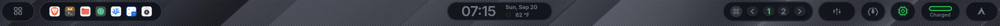

## Menu
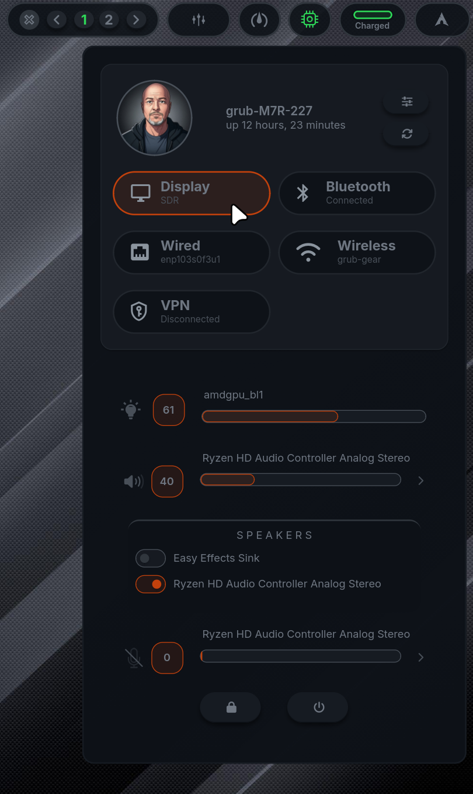

## Notifications
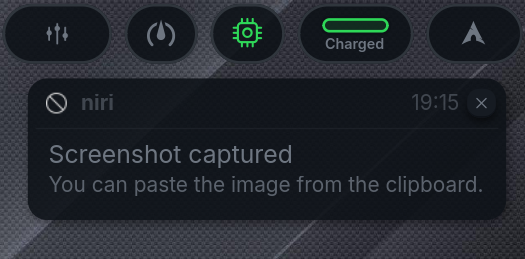

## Lock Screen
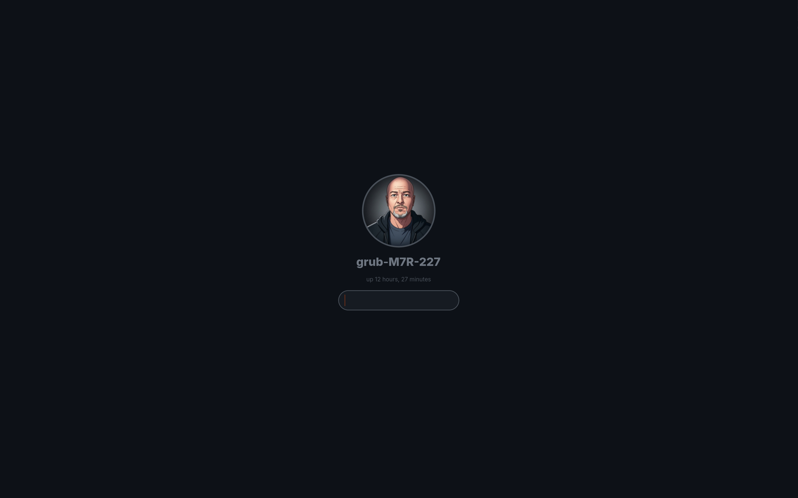

## Power Options 
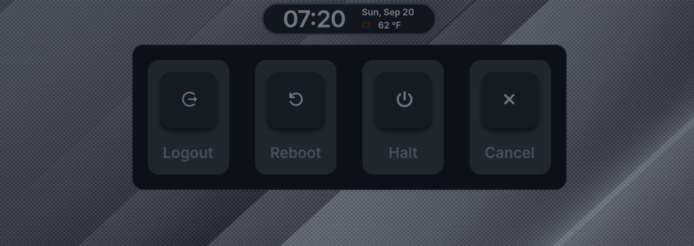

## Today
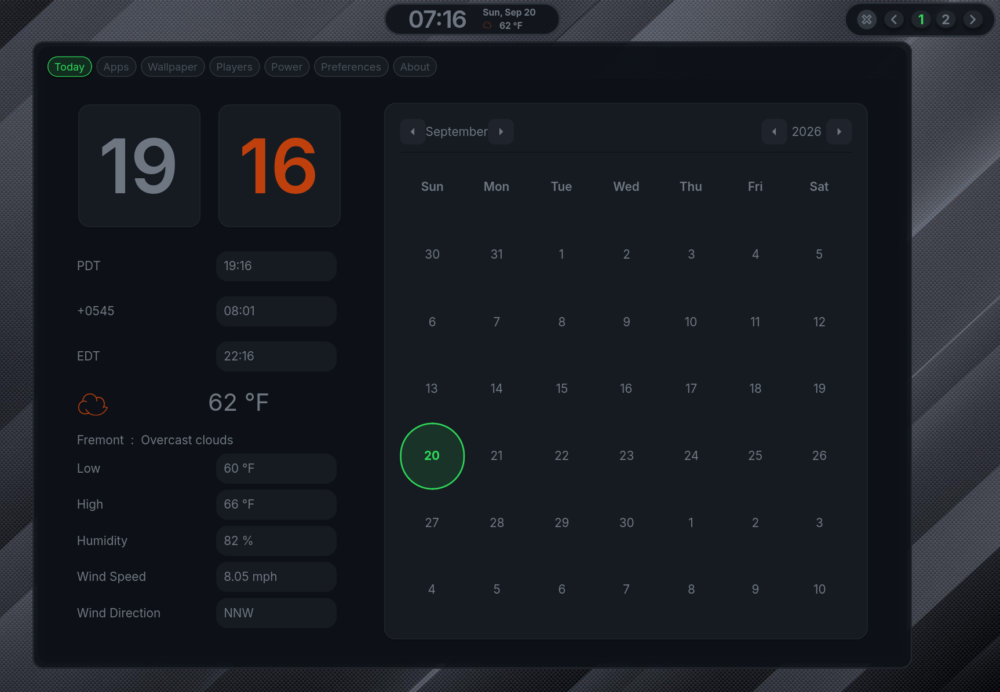

## Apps
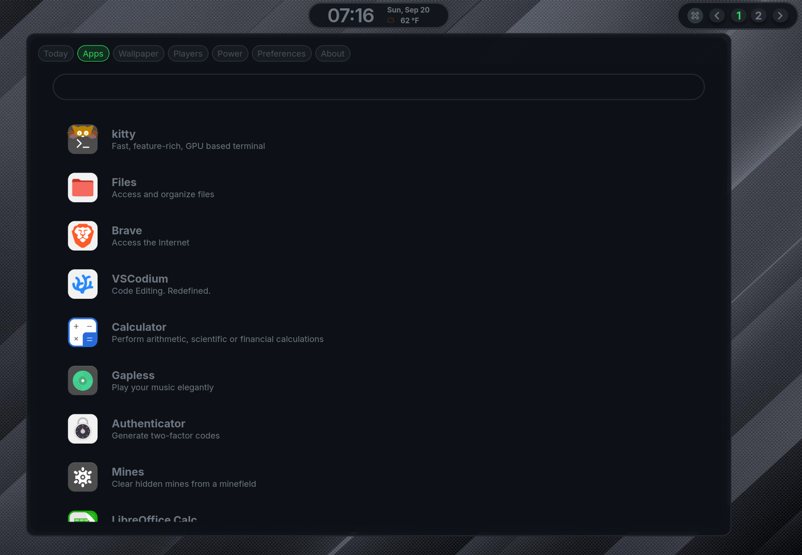

## Wallpaper 
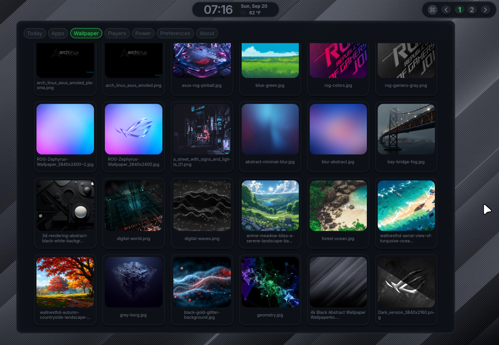

## Mpris
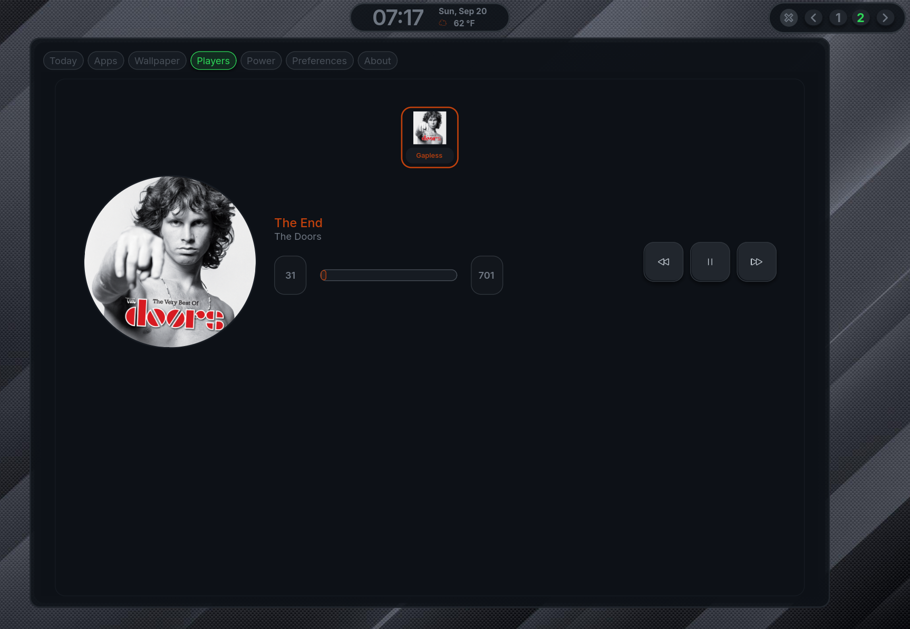

## Power
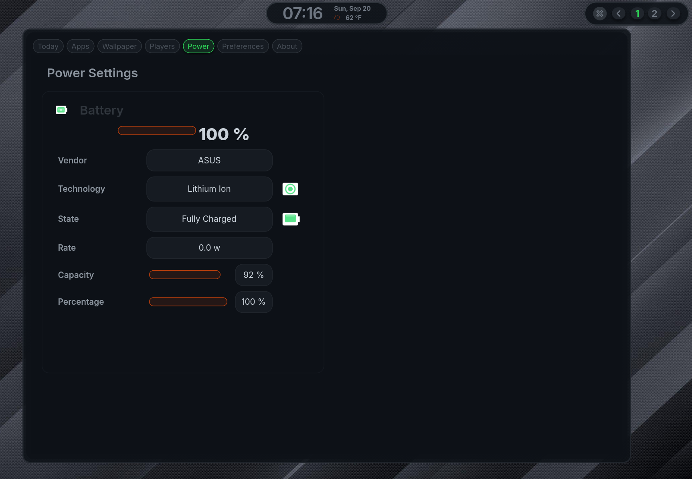

## About 
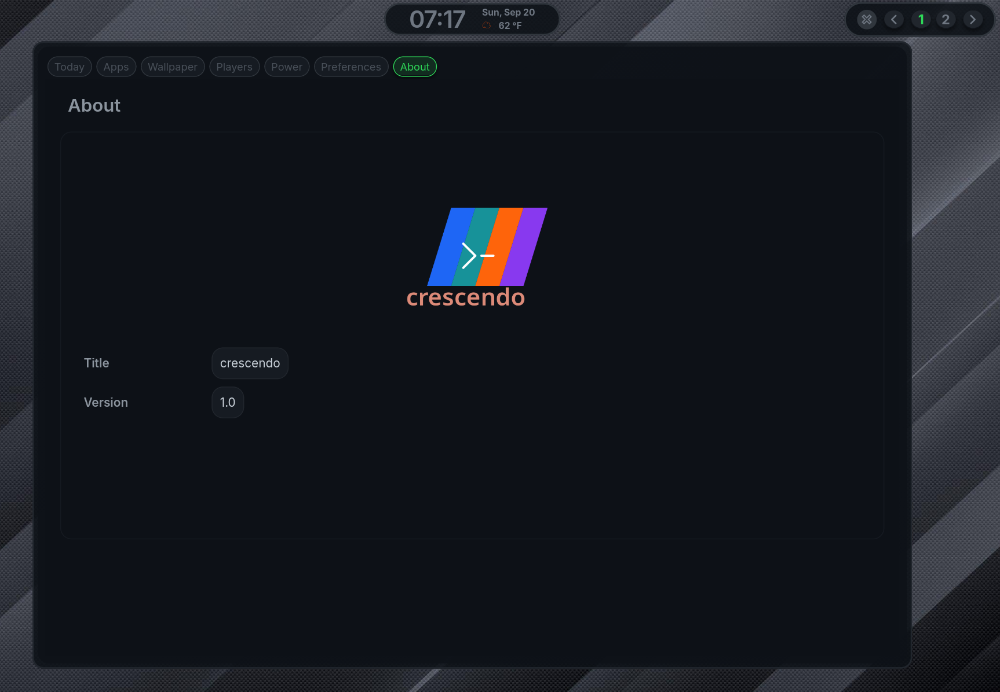

## Preferences 
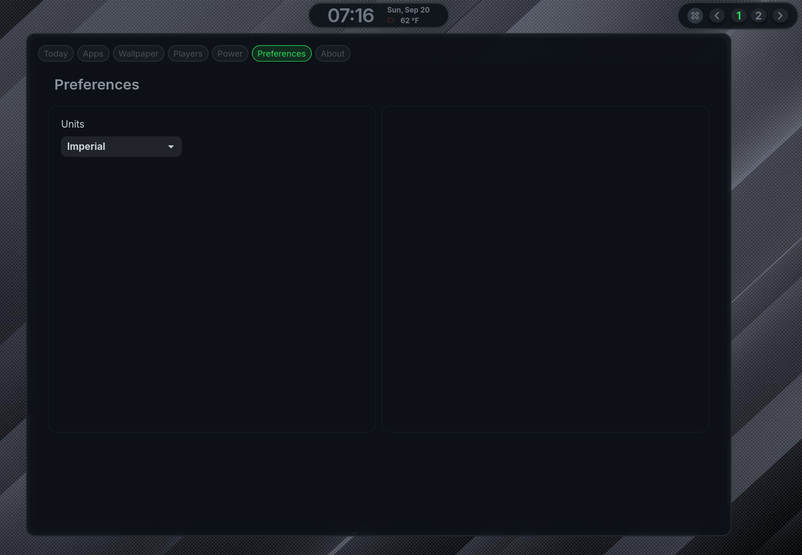

## Desktop Context Menu
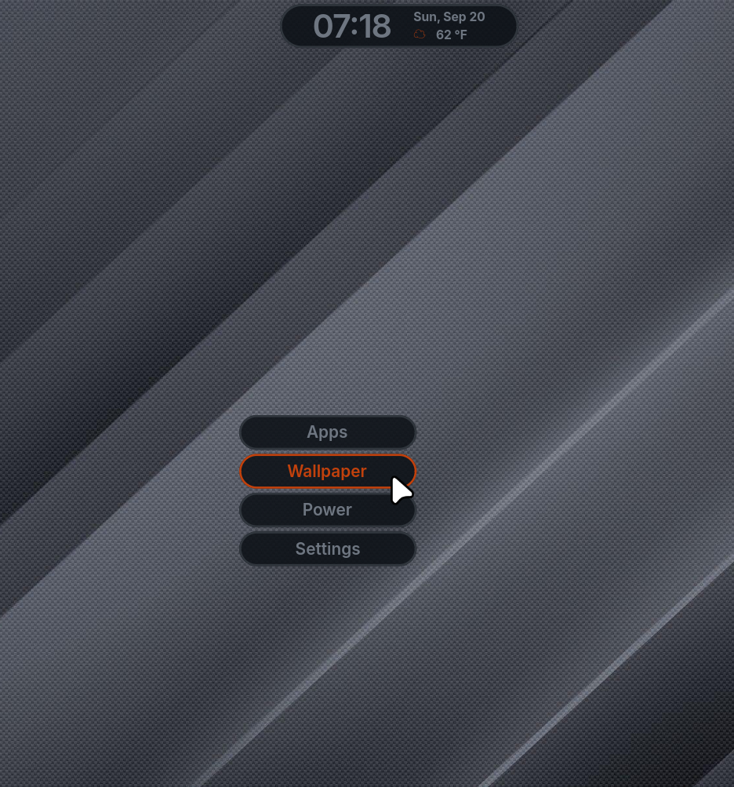

## Profile the application
GJS_ENABLE_PROFILER=1 ags run

## Bundle the package
ags bundle app.ts $HOME/.config/crescendo/crescendo